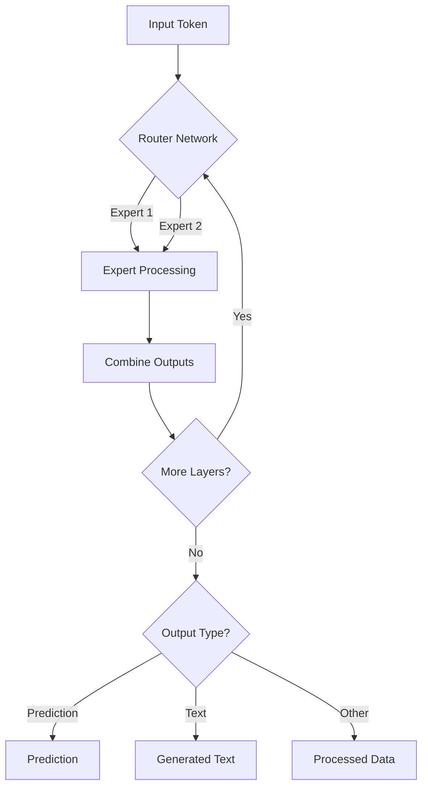

# Simpler breakdown of MOE model

**Imagine a company with specialized departments:**

* **Sales:** Focuses on closing deals and generating revenue.
* **Marketing:** Creates campaigns to attract new customers.
* **Customer Support:** Helps existing customers with their issues.
* **Product Development:** Creates new products and improves existing ones.

Each department has its own expertise and handles specific tasks.

**Now, imagine a customer interacts with this company:**

1. **Customer Inquiry:** A customer contacts the company with a question or request.
2. **Reception (Router):** The receptionist determines which department is best suited to handle the customer's inquiry based on the nature of their request.
3. **Department Handling (Expert Processing):** The customer's inquiry is routed to the appropriate department, where experts with specialized knowledge address the customer's needs.
4. **Response (Combine Outputs):** The department provides a response or solution to the customer.
5. **Further Assistance (More Layers?):** If the customer has additional questions or requires further assistance, the receptionist may route them to another department or back to the same department for follow-up.
6. **Resolution (Output Type):** The interaction may result in a sale, a resolved issue, or valuable feedback for product development.

**This is similar to how an MoE model works:**

* **Input Token:** Instead of a customer inquiry, it's a piece of data (like a word in a sentence).
* **Router Network:** Acts like the receptionist, directing the data to the appropriate expert.
* **Expert Processing:** Experts are like specialized departments, each handling a specific type of data or task.
* **Combine Outputs:** The results from different experts are combined to provide a complete response.
* **More Layers?:** The data may be processed by multiple layers of experts for complex tasks.
* **Output Type:** The final output could be a prediction, a piece of generated text, or another form of processed information.

**Key takeaways for business people:**

* **Efficiency:** MoE models can be more efficient than traditional models because they only use the necessary "experts" for each task, similar to how specialized departments focus on their core competencies.
* **Scalability:** MoE models can handle larger and more complex tasks by distributing the workload among multiple experts, just as a company with diverse departments can manage a wider range of customer needs.
* **Adaptability:** MoE models can adapt to different types of data and tasks by leveraging the expertise of different experts, similar to how a company can adjust its approach based on customer feedback and market trends.

The above methodology allows MOE models to solve complex problems and improving efficiency in various applications.

## Flowchart
